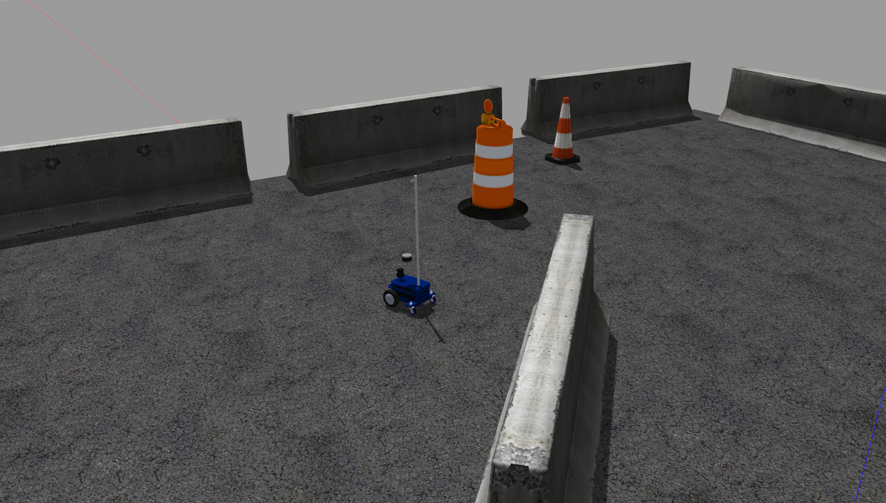
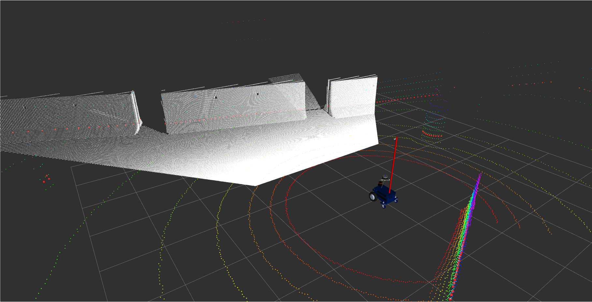

# Magni Robot
## Installation
1. Clone this repository into your workspace
2. Clone [velodyne_description](http://wiki.ros.org/velodyne_description) if you want to use 3D Velodyne laser scanners
3. Clone [realsense_gazebo_plugin](https://github.com/pal-robotics/realsense_gazebo_plugin) if you want to use realsense D435
4. catkin_make

## How to run
1. roslaunch magni_gazebo followme_test.launch 

## Actively Using packages:
- magni_gazebo
- magni_teleop
- magni_description
- magni_teleop

  
  Gazebo interface

  
  RVIZ interface

## Notes:
1. You can check the full original README [here](https://github.com/UbiquityRobotics/magni_robot).
